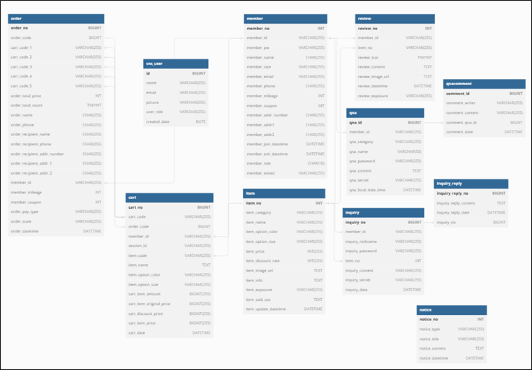

# Mysoho Project

### Purpose

이 프로젝트의 목적은 HTML, JavaScript, CSS, 그리고 Spring Boot (Java)을 이용하여 쇼핑몰 웹사이트를 구현하는 것입니다. 이 웹사이트는 [마이소호 샘플샵 웹사이트](https://sohonara.mysoho.com/)을 기반으로 만들어졌으며, 사용자들에게 편리한 쇼핑 경험을 제공하기 위해 다양한 기능을 포함하고 있습니다.

또한, 관리자 페이지도 구현하여 쇼핑몰 웹사이트의 운영과 관련된 작업을 수행할 수 있도록 합니다. 이 관리자 페이지는 상품, 주문, 회원, 리뷰, 상품 문의, 통합 문의, 공지사항 관리 등의 기능으로 구성되어 있으며, 오직 관리자 권한을 가진 사람들만 접근할 수 있습니다.

또한, 하이브리드 앱도 구현되어 쇼핑몰 웹사이트의 기능과 내용을 모바일 환경에서도 활용할 수 있게 합니다. 이 하이브리드 앱은 Android 플랫폼에서 실행될 수 있습니다.

#### **Functionality**

- 상품 목록 및 상세 정보

  해당 웹사이트는 다양한 의류 상품들을 카테고리별 목록으로 제공합니다. 각 상품은 이미지, 가격, 설명 등의 상세 정보를 포함하고 있으며, 사용자는 원하는 상품을 쉽게 찾아볼 수 있습니다.

- 장바구니 기능

  웹사이트에는 장바구니 기능이 포함되어 있어 사용자가 원하는 상품을 장바구니에 담을 수 있습니다. 장바구니 페이지에서는 상품의 수량을 조절하거나 삭제할 수 있으며, 결제 과정을 원활하게 진행할 수 있습니다.

- 회원 가입 및 로그인

  해당 웹사이트는 사용자가 회원으로 가입하고 로그인할 수 있는 기능을 제공합니다. 회원으로 가입하면 개인 정보를 저장하고, 주문 내역을 확인하고, 추가 혜택을 받을 수 있습니다. 또한 구글, 카카오, 네이버와 같은 SNS 로그인을 지원합니다. 사용자는 편리하게 자신의 SNS 계정을 통해 로그인할 수 있습니다.

- 주문 및 결제

  사용자가 원하는 상품을 선택한 후에 장바구니 페이지에서 결제 과정을 진행하거나 상품 상세 페이지에서 바로 결제 과정을 진행할 수 있습니다. 결제가 완료된 뒤, 사용자는 주문 상태를 추적할 수 있습니다.

- 리뷰 기능

  웹사이트는 리뷰 기능이 포함되어 있어 사용자들은 구매한 상품에 대한 리뷰를 작성하고 별점을 부여할 수 있습니다. 이를 통해 다른 사용자들은 리뷰를 참고하여 구매 결정을 내릴 수 있습니다.

- 문의 기능

  웹사이트에는 통합 문의 기능과 상품 문의 기능이 포함되어 있습니다. 사용자들은 질문을 작성하고 관련 문의에 대한 답변을 받을 수 있습니다.

- 공지 및 이벤트 기능

  관리자는 웹사이트에 공지사항을 게시하고 이벤트를 등록할 수 있습니다. 사용자들은 공지사항을 확인하고 참여 가능한 이벤트에 참여할 수 있습니다.

- 관리자 기능

  웹사이트에는 관리자용 기능도 포함되어 있습니다. 관리자는 상품을 추가, 편집, 삭제할 수 있으며, 주문 상태를 관리하고 사용자의 문의에 응답할 수 있습니다. 또한, 관리자는 웹사이트에 등록된 회원들을 관리하고, 회원의 정보를 편집하거나 삭제할 수 있으며 리뷰를 모니터링하고 필요한 조치를 취할 수 있습니다. 그리고 공지사항이나 이벤트를 등록하고 관리할 수 있습니다.

### Reference Site

[마이소호 샘플샵](https://sohonara.mysoho.com/)

### Development Environment

|              |                                                   |
| ------------ | ------------------------------------------------- |
| OS           | Windows 10                                        |
| Language     | Java, JavaScript, HTML/CSS, Kotlin                |
| Tool         | VS Code, SpringBoot, IntelliJ, Bootstrap5, Github |
| Server       | Tomcat 9                                          |
| DB           | MariaDB, AWS RDS                                  |
| Distribution | Github Actions, AWS Code Deploy, AWS S3, AWS EC2  |

### Database

### Demonstration

[마이소호 시연 영상](https://youtu.be/A38tptt7irM)

### Report

[화면기획서(관리자)](./화면기획서-관리자.pdf)

[완료 보고서](./mysoho완료보고서.pdf)

### Team Members

박선교 김은진 서경빈 이준하 이지성 정희진
